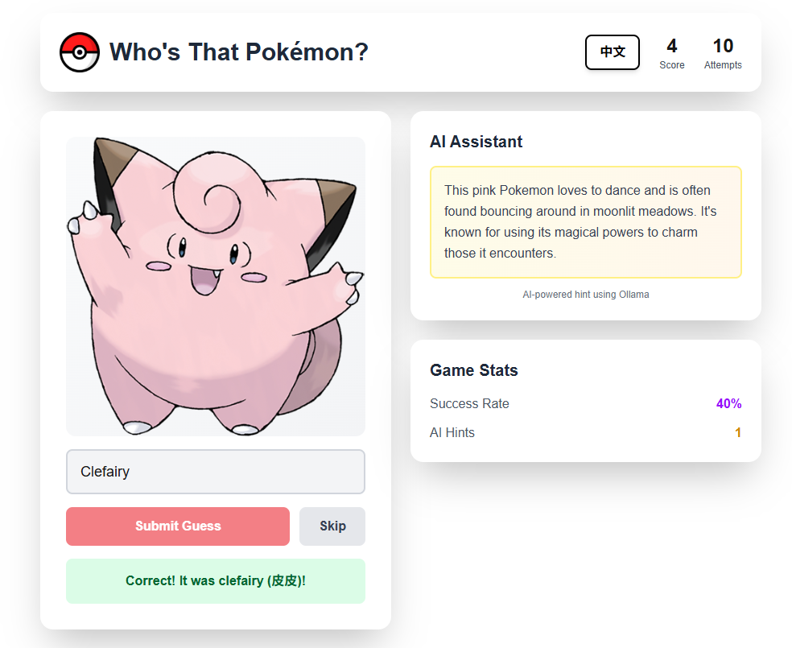

# Pokemon Guess Game 🎮

An interactive game helps new Pokémon trainers to get familiar with various Pokémons ❤️❤️❤️



## Features

- **Silhouette Guessing**: Guess Pokémon from their shadowed images
- **AI Assistant**: Get creative AI-generated hints using Ollama
- **Score Tracking**: Keep track of your success rate

## Tech Stack

**Backend:**
- Java 17+
- Spring Boot 3.x
- PostgreSQL
- Ollama (Local AI)
- RestTemplate for API calls

**Frontend:**
- React 18
- Tailwind CSS
- Gradle

## Prerequisites

1. **Java 17 or higher**
2. **PostgreSQL** database
3. **Ollama** installed locally
4. **Node.js** (for frontend development)
5. **Gradle** (for building backend)

## Setup Instructions

### 1. Install Ollama

```bash
# Visit https://ollama.ai and install Ollama for your OS

# Pull the required model
ollama pull gemma2:9b

# Verify Ollama is running (default port 11434)
curl http://localhost:11434/api/tags
```

### 2. Setup PostgreSQL Database

```sql
-- Create database
CREATE DATABASE pokeguess;

-- Connect to the database
\c pokeguess

-- The application will auto-create tables on first run
```

### 3. Configure Backend

Update `src/main/resources/application.properties`:

```properties
# Database Configuration
spring.datasource.url=jdbc:postgresql://localhost:5432/pokeguess
spring.datasource.username=postgres
spring.datasource.password=YOUR_PASSWORD
spring.datasource.driver-class-name=org.postgresql.Driver

# JPA Configuration
spring.jpa.hibernate.ddl-auto=update
spring.jpa.show-sql=true

# Server Configuration
server.port=8888

# Ollama Configuration
ollama.url=http://localhost:11434
ollama.default-model=gemma2:9b
```

### 4. Build and Run Backend

```bash
# Navigate to project root
cd pokeguess

# Build with Maven
./mvnw clean install

# Run the application
./mvnw spring-boot:run

# Or run the JAR directly
java -jar target/pokeguess-0.0.1-SNAPSHOT.jar
```

The backend will:
- Start on `http://localhost:8888`
- Automatically fetch and populate 151 Gen 1 Pokemon from PokeAPI
- Connect to Ollama for AI hints

### 5. Setup Frontend

Save the React component as `PokemonGuessGame.jsx` or use it directly in your React project:

```bash
# If using Create React App
npx create-react-app pokemon-game-frontend
cd pokemon-game-frontend

# Install dependencies
npm install lucide-react

# Copy the component to src/App.js
# Update the API_BASE URL if needed

# Start the development server
npm start
```

The frontend will open at `http://localhost:3000`

## API Endpoints

### Game Endpoints

**GET** `/api/pokemon/quiz`
- Returns a random Pokémon with ID and image URL

**POST** `/api/pokemon/check`
- Body: `{ "id": 1, "userAnswer": "Bulbasaur" }`
- Returns: `{ "correct": true, "correctName": "Bulbasaur (妙蛙种子)" }`

**GET** `/api/pokemon/hints/{id}`
- Returns hints: type, height, weight, color

**GET** `/api/pokemon/ai-hint/{id}`
- Returns AI-generated creative hint

**GET** `/api/pokemon/health`
- Health check endpoint

### Legacy AI Endpoints (Still Available)

**POST** `/api/ai/pokemon/ask`
**GET** `/api/ai/pokemon/detail/{name}`
**GET** `/api/ai/pokemon/battle-advice`
**POST** `/api/ai/pokemon/generate-story`

## Project Structure

```
pokeguess/
├── src/main/java/com/example/pokeguess/
│   ├── PokeguessApplication.java
│   ├── config/
│   │   └── AppConfig.java
│   ├── controller/
│   │   ├── PokemonController.java          # Legacy AI endpoints
│   │   └── PokemonGameController.java      # New game endpoints
│   ├── dto/
│   │   └── PokemonGuessDTO.java
│   ├── model/
│   │   └── Pokemon.java
│   ├── repo/
│   │   └── PokemonRepository.java
│   ├── service/
│   │   ├── OllamaService.java
│   │   ├── PokemonExpertService.java       # Legacy service
│   │   ├── PokemonGameService.java         # New game service
│   │   └── PokemonService.java
│   └── util/
│       └── DataInitializer.java
└── src/main/resources/
    └── application.properties
```

## How to Play

1. **Look at the Silhouette**: A Pokemon appears as a black shadow
2. **Use Hints**: Click "Reveal Hint" to see Type, Height, Weight, or Color
3. **Get AI Help**: Click "Get AI Hint" for a creative clue from Ollama
4. **Make Your Guess**: Type the Pokemon's name (English or Chinese)
5. **Submit**: Press Enter or click "Submit Guess"
6. **Score Points**: Correct answers reveal the Pokemon and add to your score!

## Troubleshooting

### Backend won't start
- Check PostgreSQL is running: `pg_isready`
- Verify database credentials in `application.properties`
- Ensure Java 17+ is installed: `java -version`

### AI hints not working
- Verify Ollama is running: `ollama list`
- Check Ollama URL in `application.properties`
- Ensure `gemma2:9b` model is pulled: `ollama pull gemma2:9b`

### Frontend can't connect to backend
- Verify backend is running on port 8888
- Check CORS settings in controllers
- Update `API_BASE` URL in the React component if needed

### Database initialization fails
- Check internet connection (fetches from PokeAPI)
- Increase timeout if needed
- Check console for specific errors

## Performance Tips

1. **First Load**: Initial database population takes 5-10 minutes
2. **AI Hints**: First hint might be slow as Ollama loads the model
3. **Caching**: Species data is cached to reduce API calls
4. **Rate Limiting**: Built-in delay prevents overwhelming PokeAPI

## Future Enhancements

- [ ] Add difficulty levels (Gen 1-9)
- [ ] Multiplayer mode with leaderboards
- [ ] Daily challenges
- [ ] Sound effects and music
- [ ] Mobile app version
- [ ] More AI interactions (battle predictions, team building)

## Credits

- Pokemon data from [PokeAPI](https://pokeapi.co/)
- Pokemon sprites from [PokeAPI Sprites](https://github.com/PokeAPI/sprites)
- AI powered by [Ollama](https://ollama.ai/)
- Icons by [Lucide](https://lucide.dev/)

## License

MIT License - Feel free to use and modify!

---

**Made with ❤️ for Pokemon fans**
